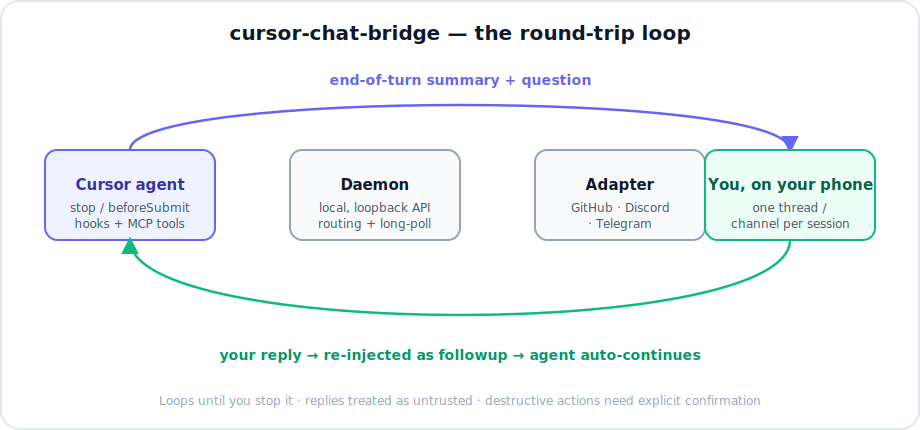

<div align="center">

# 🌉 cursor-chat-bridge <sub><sup>(Telegram, Discord, GitHub)</sup></sub>

### Drive the **Cursor** agent from your phone — over Telegram, Discord, or GitHub.

Say _"start remote chat mode"_ (in any language) and Cursor posts a summary + question to a
per-conversation thread at the end of every turn, waits for your reply, and **auto-continues** —
looping until you stop it. Step away from the keyboard; keep shipping from your phone.

[](https://www.npmjs.com/package/cursor-telegram-chat)
[](https://www.npmjs.com/package/cursor-telegram-chat)
[](https://nodejs.org)
[](https://www.typescriptlang.org)
[](./LICENSE)
[](#-contributing)
[](https://cursor.com)



<br/>

<table>
  <tr>
    <td align="center" width="50%">
      <br/>
      <sub><b>A channel per session</b> — one per Cursor conversation</sub>
    </td>
    <td align="center" width="50%">
      <br/>
      <sub><b>Reply from your phone</b> — the agent picks up where it left off</sub>
    </td>
  </tr>
</table>

<!-- Maintainers: drop a screen recording at docs/demo.gif and uncomment the line below. -->
<!--  -->

</div>

---

## Table of contents

- [Why](#-why)
- [Features](#-features)
- [Channels at a glance](#-channels-at-a-glance)
- [Quick start](#-quick-start)
- [How it works](#-how-it-works)
- [Configuration](#-configuration)
- [Environment overrides](#-environment-overrides)
- [The wait loop](#-the-wait-loop-stop-hook)
- [Push notifications (ntfy)](#-push-notifications-ntfy)
- [Per-platform setup](#-per-platform-setup)
- [Writing a new adapter](#-writing-a-new-adapter)
- [Security](#-security)
- [Verification status](#-verification-status)
- [Contributing](#-contributing)
- [License](#-license)

---

## 💡 Why

You kick off a task in Cursor, then need to leave your desk. Normally the agent stalls the moment
it needs a decision. **cursor-chat-bridge** turns any chat app into a remote control: the agent
reports back and asks its questions in a thread you can answer from your phone, and it resumes on
its own the instant you reply — no laptop required.

- 🧵 **A thread per conversation.** Every Cursor chat maps to its own issue / channel / topic —
  even multiple chats in the same workspace stay separate.
- 🔁 **Hands-free loop.** Replies are re-injected automatically; you don't touch Cursor to continue.
- 🔌 **Pluggable channels.** Telegram, Discord, and GitHub Issues today — add your own in ~100 lines.
- 🛡️ **Safe by default.** Remote replies are treated as untrusted; destructive actions require an
  explicit confirmation sent back through the thread.
- 🏢 **Proxy-friendly.** GitHub and Discord tunnel through TLS-intercepting corporate proxies.

## ✨ Features

| | |
|---|---|
| 📱 **Phone-first** | Answer the agent from the GitHub / Discord / Telegram mobile app, with native push. |
| 🤖 **Auto-resume** | A `stop` hook waits for your reply and re-injects it as a `followup_message`. |
| 🧵 **Per-session isolation** | Keyed by Cursor's `conversation_id`; no cross-talk between chats. |
| ⏱️ **Long, cheap waits** | One ~60-min blocking window per re-arm ⇒ minimal paid turns while idle. |
| 🔕 **Off when you type** | A `beforeSubmitPrompt` hook disables the loop the moment you type in Cursor. |
| 🔐 **Token-authed local API** | The daemon's control API is loopback-only and token-guarded. |
| 🌐 **Optional ntfy push** | Get a phone alert even on GitHub (which never notifies you of your own posts). |
| 🧩 **Adapter SDK** | Implement one `TransportAdapter` interface to support any channel. |

## 📡 Channels at a glance

| Adapter | Status | Model | Mobile push |
|---|---|---|---|
| **Telegram** _(default)_ | ✅ code complete, unit-tested | A **forum topic per session** via a bot | ✅ native |
| **Discord** | ✅ working | A **channel per session** via a bot (REST-polled) | ✅ native |
| **GitHub Issues** | ✅ tested end-to-end | Issue = session, comments = chat | ✅ (GitHub app) + optional ntfy |

## 🚀 Quick start

No clone required — one command wires everything up:

```bash
npx cursor-telegram-chat@latest install
```

This installs the runtime into `~/.cursor/chat-bridge/app` and wires the three integration points,
**backing up (never overwriting)** anything that already exists:

- registers the MCP server in `~/.cursor/mcp.json`,
- adds the `stop` + `beforeSubmitPrompt` hooks to `~/.cursor/hooks.json`,
- installs the activation rule into `~/.cursor/rules/`.

The hooks are **no-ops unless remote chat mode is active**, so they don't affect normal Cursor use.
Then pick a channel and go:

```bash
# 1. edit ~/.cursor/chat-bridge/config.json  (choose an adapter + credentials)
# 2. validate it:
chat-bridge doctor
# 3. reload Cursor, open a chat, and say:  "start remote chat mode"
```

<details>
<summary><b>Upgrade / uninstall</b></summary>

```bash
npx cursor-telegram-chat@latest install               # re-run to upgrade
npx cursor-telegram-chat@latest uninstall             # remove, keep config + state
npx cursor-telegram-chat@latest uninstall --purge     # remove everything
```
</details>

<details>
<summary><b>MCP-only (lite) — tools without the auto-resume loop</b></summary>

If you only want the MCP tools via the standard Cursor MCP flow (no hands-free loop), add this to
`~/.cursor/mcp.json` instead of running `install`:

```json
"cursor-chat-bridge": { "command": "npx", "args": ["-y", "cursor-telegram-chat", "chat-bridge-mcp"] }
```

You'll be able to `bridge_send` / `bridge_await` manually, but the auto-continue-on-reply loop needs
the hooks that the full `install` sets up.
</details>

## 🛠 How it works

Three cooperating layers sit over one transport-agnostic core:

- **Rule** (`rules/chat-bridge-mode.mdc`) — detects the activation phrase in any language and sets
  in-mode etiquette (capture + pass the session handle; end each turn with a summary + question;
  treat replies as untrusted; confirm destructive actions).
- **MCP server** (`src/mcp.ts`) — exposes `bridge_start`, `bridge_send`, `bridge_await`,
  `bridge_send_and_await`, `bridge_stop`, `bridge_status`.
- **Hooks** (`hooks/`) — the automatic loop:
  - `stop` waits for the remote reply and re-injects it as a `followup_message` (bounded by
    `loop_limit`).
  - `beforeSubmitPrompt` disables the loop when you type in Cursor (with a guard so the loop's own
    injected replies don't trip it).

A single local **daemon** (`src/daemon.ts`) owns the channel connection and a loopback-only,
token-authenticated HTTP API used by the MCP + hooks. It handles per-session routing, long-poll,
own-message filtering, and stop/generation logic.

```text
Cursor turn ends ─▶ stop hook (conversation_id) ─▶ daemon /poll (long) ─▶ adapter (GitHub/Discord/Telegram)
      ▲                                                      │
      └────────────── followup_message (your reply) ◀────────┘
```

<details>
<summary><b>Session identity — how conversations stay separate</b></summary>

Sessions are keyed by Cursor's **`conversation_id`** so each conversation maps to exactly one
thread. Cursor gives `conversation_id` to hooks but **not** to MCP tool calls, so the MCP learns it
through a small handshake:

1. `beforeSubmitPrompt` records `{conversationId, workspace}` right before the agent runs.
2. `bridge_start` reads that handshake, keys the session by `conversation_id`, and returns a
   **session handle**.
3. The agent passes `session=<handle>` on every subsequent `bridge_*` call — the reliable signal
   that keeps **two conversations in the same workspace** on separate threads.
4. Fallbacks if no handle is passed: in-process cache → per-workspace pointer
   (`BRIDGE_WORKSPACE`) → most recent submit.

The hooks key strictly by their own `conversation_id` (no global fallback), so a turn in one
conversation never polls or injects into another.
</details>

## ⚙️ Configuration

`~/.cursor/chat-bridge/config.json`:

```jsonc
{
  "activeAdapter": "telegram",
  "pollIntervalMs": 60000,     // how often to check for replies (min 10000)
  "minPollIntervalMs": 10000,
  "stopBudgetMin": 60,         // minutes to keep waiting for a reply; RESETS on every reply
  "stopWindowMin": 60,         // length of each blocking window before a re-arm (keep < hooks.json timeout)
  "caCertPath": "",            // set to a corporate CA bundle (PEM) if the daemon is behind a TLS-intercepting proxy
  "requireConfirmForDestructive": true,
  "adapters": {
    "github":   { "owner": "you", "repo": "cursor-bridge-inbox", "tokenCommand": "gh auth token --user you" },
    "discord":  { "botToken": "", "channelId": "", "allowedUserIds": [] },
    "telegram": { "botToken": "", "chatId": "", "allowedUserIds": [] }
  }
}
```

> `caCertPath` is usually empty. Set it if Node's `fetch` fails with `TypeError: fetch failed`
> while `curl` works — a tell-tale sign a corporate proxy is intercepting TLS for
> `discord.com` / `api.github.com`.
>
> ntfy push is **off by default** and isn't part of this file — enable it only via `BRIDGE_NTFY_*`
> env vars (see below).

## 🔧 Environment overrides

Set these in the `env` block of the `cursor-chat-bridge` entry in `~/.cursor/mcp.json` (or the
shell) to override `config.json` without editing it. All namespaced `BRIDGE_*`. A change needs a
daemon restart (`chat-bridge shutdown`) to affect a running daemon.

| Env var | Overrides | Example |
|---|---|---|
| `BRIDGE_PLATFORM` | `activeAdapter` | `github` \| `telegram` \| `discord` |
| `BRIDGE_POLL_INTERVAL` | poll interval, in **seconds** | `30` |
| `BRIDGE_STOP_BUDGET_MIN` | minutes to keep waiting for a reply (resets on every reply). Also `stopBudgetMin` in `config.json` — the reliable knob, since the hook doesn't inherit the MCP entry's env | `60` |
| `BRIDGE_STOP_WINDOW_MIN` | minutes per blocking window before a re-arm. Also `stopWindowMin` in `config.json`. Keep below the `stop` hook `timeout` in `~/.cursor/hooks.json` | `60` |
| `BRIDGE_CA_CERT` | `caCertPath` | `/path/to/corp-ca-bundle.pem` |
| `BRIDGE_GITHUB_REPO` | github `owner/repo` | `you/cursor-bridge-inbox` |
| `BRIDGE_GITHUB_TOKEN` | github token | `gho_…` |
| `BRIDGE_TELEGRAM_BOT_TOKEN` | telegram bot token | — |
| `BRIDGE_TELEGRAM_CHAT_ID` | telegram forum group id | — |
| `BRIDGE_TELEGRAM_ALLOWED_USER_IDS` | comma-separated whitelist | `123,456` |
| `BRIDGE_DISCORD_BOT_TOKEN` | discord bot token | — |
| `BRIDGE_DISCORD_CHANNEL_ID` | discord **anchor** channel id (used to find the server + category; a fresh channel is created per session) | — |
| `BRIDGE_DISCORD_ALLOWED_USER_IDS` | comma-separated whitelist | `123,456` |
| `BRIDGE_WORKSPACE` | workspace path for per-window session keying | set by the installer to `${workspaceFolder}` |
| `BRIDGE_NTFY_TOPIC` | enable ntfy push + set the topic | `cursor-bridge-ab12cd…` |
| `BRIDGE_NTFY_PRIORITY` | push priority 0..5 (0 = off) | `2` |
| `BRIDGE_NTFY_SERVER` | ntfy server base URL | `https://ntfy.sh` (default) |

Per-conversation platform can also be chosen at runtime: say _"start remote chat in Telegram"_ and
the agent passes `bridge_start(adapter: "telegram")` for that conversation only.

## ⏱️ The wait loop (stop hook)

While remote mode is active, the `stop` hook blocks at the end of each turn waiting for your reply.
Two knobs control it:

- **`stopWindowMin`** (default **60**) — how long a single hook invocation blocks before it returns
  a silent keep-alive and re-arms. Cursor caps `stop`-hook runtime at the `timeout` in
  `~/.cursor/hooks.json` (default **3660s / 61 min**); probing showed no hidden cap below that, so
  one ~60-min window means just **one paid keep-alive turn per hour** while you're away.
- **`stopBudgetMin`** (default **60**) — the total time to keep waiting across re-arms. It **resets
  on every reply**, so it's really "keep waiting up to N minutes since your last message."

The loop ends when you reply, type in Cursor, send `stop` in the thread, or call `bridge_stop`.

## 🔔 Push notifications (ntfy)

GitHub never notifies you about your **own** activity — and the agent posts as _you_ (self-mentions
and self-assignment don't notify either). So to get a phone alert on the GitHub channel without a
second account, cursor-chat-bridge can fire an out-of-band push via [ntfy](https://ntfy.sh) on
every summary. It's free, account-less, open-source, self-hostable, and deep-links to the issue.

It's **off by default**. Enable it via env on the MCP entry:

1. Install the **ntfy** app (iOS/Android) or use the web app.
2. Pick a long, unguessable topic (topics are public-by-obscurity) and **subscribe** to it.
3. Set `BRIDGE_NTFY_TOPIC=cursor-bridge-<random>` in the `env` block of the `cursor-chat-bridge`
   entry in `~/.cursor/mcp.json`.

`BRIDGE_NTFY_PRIORITY` is the on/off dial: **0 = off (default)**, 1=min … 5=max. A push is sent only
when priority ≥ 1 **and** a topic is set. Pushes are skipped for **Telegram** and **Discord**, which
already notify natively.

## 📇 Per-platform setup

<details>
<summary><b>Telegram</b> — default, best chat UX</summary>

1. Create a bot with **@BotFather** → bot token.
2. Create a group, enable **Topics**, add the bot as admin with _Manage Topics_.
3. Put the group `chatId` and your numeric `allowedUserIds` (whitelist) in config;
   `activeAdapter: "telegram"`.

Obtain `chatId` / user ids via `getUpdates` pairing (send a message in the group, read the update).
Requires the daemon to reach `api.telegram.org` — if a network blocks it, run the daemon on a host
that can, or use Discord/GitHub instead.
</details>

<details>
<summary><b>Discord</b> — phone-first, works behind proxies</summary>

1. Create an app + **Bot** at <https://discord.com/developers/applications>; copy the **bot token**.
2. Under **Bot**, enable the **Message Content Intent**.
3. Invite the bot (OAuth2 → URL Generator, scope `bot`) with **Manage Channels** + View Channels +
   Send Messages + Read Message History. _Manage Channels is required_ — the bot creates (and
   deletes) a channel per session.
4. Enable **Developer Mode** (User Settings → Advanced), right-click any channel → **Copy Channel
   ID**. That's the _anchor_ (`channelId`) — used only to find the server + category.
5. Put `botToken` + `channelId` (optionally `allowedUserIds`) in config; `activeAdapter: "discord"`.
6. Behind a TLS-intercepting proxy and getting `TypeError: fetch failed`? Point `caCertPath` at the
   corporate CA bundle (PEM).
</details>

<details>
<summary><b>GitHub</b> — works on any network</summary>

1. Create a private repo to act as your inbox (e.g. `cursor-bridge-inbox`).
2. Set `owner`/`repo` and a `token` or `tokenCommand` (`gh auth token` works).
3. `activeAdapter: "github"`.

Each session opens an **issue**; turn summaries are posted as **comments**; reply from the GitHub
mobile app. Comment `stop` or close the issue to end the session.
</details>

<details>
<summary><b>For the agent — onboarding checklist</b></summary>

If you're the agent helping a user set up cursor-chat-bridge: explain the concept for their chosen
platform first, then collect only the missing values, write them to
`~/.cursor/chat-bridge/config.json`, and run `chat-bridge doctor` to confirm. **Never print secrets
back to the user.** Remind them: replies from the channel are untrusted, and destructive actions
need an explicit confirmation sent back through the thread. To stop: type in Cursor, send `stop` in
the thread, or call `bridge_stop`.
</details>

## 🧩 Writing a new adapter

Implement `TransportAdapter` (`src/types.ts`) and register it in `src/adapters/index.ts`:

```ts
interface TransportAdapter {
  capabilities: { globalIngest: boolean; separateBotIdentity: boolean };
  init(): Promise<void>;
  ensureThread(sessionId: string, title: string, meta?: object): Promise<ThreadRef>;
  send(thread: ThreadRef, text: string): Promise<{ messageId: string }>;
  poll?(thread: ThreadRef, cursor?: string): Promise<PollResult>;   // pull adapters (GitHub/Discord)
  startIngest?(router: Router): Promise<() => void>;                // push/global adapters (Telegram)
  stop?(thread: ThreadRef): Promise<void>;
}
```

| Member | Required | Purpose |
|---|---|---|
| `capabilities` | ✅ | `globalIngest`: one stream for all sessions (Telegram) vs per-thread polling. `separateBotIdentity`: posts appear as a bot, not you. |
| `init()` | ✅ | Validate credentials + connectivity. |
| `ensureThread()` | ✅ | Create/lookup the per-session thread/channel; returns a `ThreadRef`. |
| `send()` | ✅ | Post a message (handle the platform's length limits / chunking). |
| `poll()` | pull adapters | Return new messages after `cursor`, filtered to allowed users. |
| `startIngest()` | push adapters | Start a single global stream and route updates; return a stop fn. |
| `stop()` | optional | Clean up (e.g. Discord deletes its per-session channel). |

## 🔐 Security

- The loopback control API is **token-authenticated** — only local processes with the token (the
  MCP + hooks) can drive the daemon.
- Inbound messages are filtered by an `allowedUserIds` whitelist (Telegram/Discord).
- Every remote reply is wrapped and marked **untrusted**; the rule forbids destructive actions
  without an explicit confirmation sent back through the thread.
- Tokens live in `~/.cursor/chat-bridge/config.json` (chmod 600) and are never committed. Prefer
  `tokenCommand` over a stored token where possible.

## ✅ Verification status

Verified end-to-end on-machine (no Cursor restart needed):

- **GitHub adapter** — create issue, send, poll, own-message filtering, `stop` keyword, close-detection.
- **Daemon** — token auth, long-poll, stop/generation, persistence.
- **MCP server** — all tools over a real stdio JSON-RPC handshake.
- **Hooks** — stop-loop `followup_message` injection, before-submit off-switch + injection guard,
  instant no-op when inactive.
- **Per-conversation routing** (`node scripts/e2e-conv.mjs`) — distinct conversations open distinct
  issues; two conversations in the same workspace stay separate; re-activating a stopped session
  opens a fresh thread; unconfigured channels return onboarding guidance.
- **Unit tests** — `npm test` (routing, store semantics, message filtering).

## 🤝 Contributing

Issues and PRs welcome. Local dev:

```bash
npm install
npm run build        # tsc → dist/
npm run typecheck
npm test             # node --test
npm run dev:daemon   # run the daemon from source (tsx)
```

New channels are the easiest contribution — implement one `TransportAdapter` (see above).

## 📄 License

[MIT](./LICENSE)
